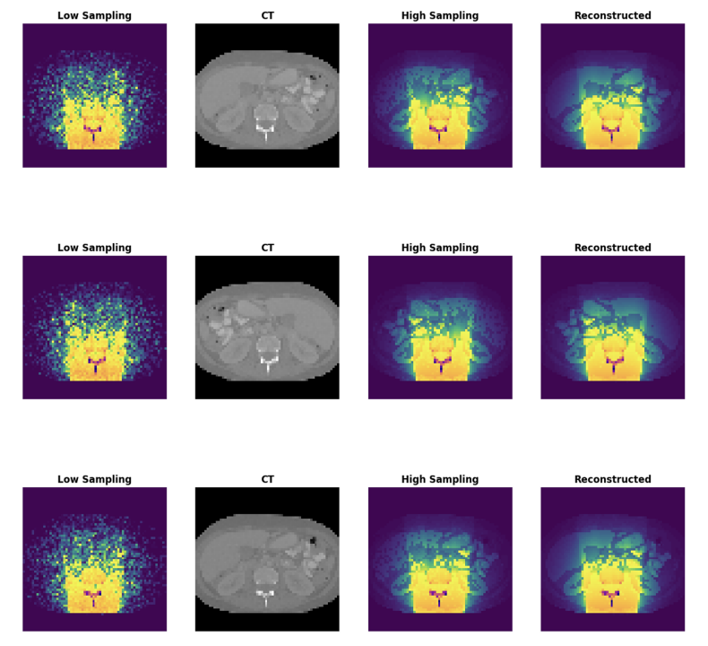

# Projet Radiothérapie
## Mise en place d'un modèle Transformers pour la dosimétrie

### Objectif du Projet

Exploiter les modèles d'apprentissage profond pour générer des cartes de dose de haute résolution à partir de données sous-échantillonnées en radiothérapie, combinant la précision des simulations Monte Carlo avec la rapidité des modèles de deep learning.

---

### Contexte

La radiothérapie repose sur la destruction ciblée de l'ADN des cellules tumorales par irradiation. La **dosimétrie** consiste à mesurer et optimiser la dose de radiation absorbée par les tissus pour maximiser l'effet sur la tumeur tout en protégeant les organes sains.

**Défi principal :** Les simulations Monte Carlo offrent une précision exceptionnelle mais nécessitent des temps de calcul très élevés (plusieurs jours).

---

### Méthodologie

#### Architecture U-Net
- Réseau de neurones convolutionnel initialement conçu pour la segmentation biomédicale
- Architecture avec connexions de saut préservant les détails importants
- Reconstruction d'images haute résolution

#### Transformers
- Intégration au goulot d'étranglement (bottleneck) du U-Net
- Mécanisme d'auto-attention pour capturer les relations à longue distance
- Traitement par patchs avec encodage positionnel

#### Segmentation GMM (Gaussian Mixture Model)
- Division des images en 4 zones selon l'absorption du corps
- Amélioration de la différenciation des régions anatomiques

---

### Résultats

| Modèle | Entrées | PSNR (dB) | Performance |
|--------|---------|-----------|-------------|
| U-Net | LS + CT Scan | 44,02 | ⭐⭐⭐⭐ |
| U-Net | CT Scan seul (Mask) | 52,57 | ⭐⭐⭐⭐⭐ |
| U-Net | LS seul | 37,65 | ⭐⭐⭐ |
| U-Net + Transformers | LS + CT Scan | 44,02 | ⭐⭐⭐⭐ |
| U-Net + Segmentation | LS + CT + Zones | 43,99 | ⭐⭐⭐⭐ |

**LS** = Low Sampling | **CT** = CT Scan | **HS** = High Sampling

---

### Reconstruction Visuelle

*Figure : Résultats de reconstruction en utilisant l'enrée Low Sampling et le CT mask avec uniquement un modèle U-Net*

---

### Points Clés

**Meilleure performance** : Utilisation du CT Scan seul (PSNR 52,57 dB)

**Apport des Transformers** : Capture efficace des relations globales entre régions

**Segmentation anatomique** : Amélioration de la précision dans les zones complexes

**Limitation** : Le Low Sampling seul ne suffit pas pour une reconstruction de qualité optimale

---

### Perspectives d'Amélioration

1. **Extensions 3D** : Application des Transformers sur données volumétriques pour mieux capturer les relations spatiales entre voxels

2. **Architectures hybrides** : Tester différentes stratégies d'intégration des Transformers au-delà du simple bottleneck

3. **Optimisation** : Exploration de variantes comme Vision Transformer (ViT) et Swin Transformers

4. **Validation clinique** : Tests sur données réelles pour évaluer la généralisation en contexte médical

---

### Équipe

Marie Feller • Youssef Sellami • Adrian Demarcy • Mahdi Choura • Sami Rabinovitch

**Date :** 3 février 2025

---

### Technologies Utilisées

- **Deep Learning** : U-Net, Transformers (Vision Transformer, Swin-T)
- **Segmentation** : Gaussian Mixture Model (GMM)
- **Métriques** : PSNR (Peak Signal-to-Noise Ratio)
- **Paramètres** : 200 epochs, batch size 10, learning rate 10⁻⁴, loss MSE
